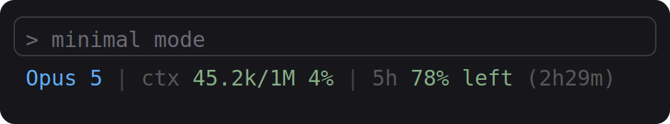
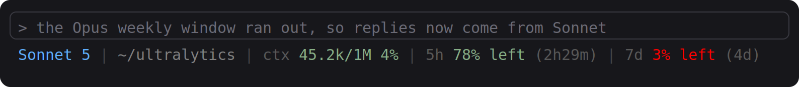
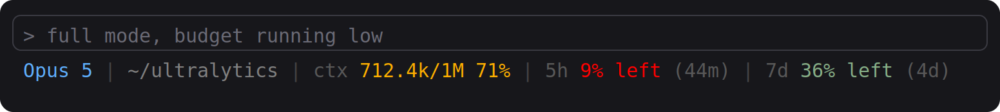
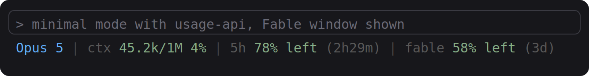

<h1 align="center">claude-code-statusline</h1>

<p align="center">
  A status line for <a href="https://code.claude.com">Claude Code</a> that shows which model
  is answering, how much context window you have used, and how much of your plan budget is
  left.
</p>

<p align="center">
  <a href="https://code.claude.com"></a>
  <a href="https://www.gnu.org/software/bash/"></a>
  <a href="https://jqlang.github.io/jq/"></a>
  <a href="LICENSE"></a>
  <a href="https://github.com/Y-T-G/claude-code-statusline/stargazers"></a>
</p>

<p align="center">
  
</p>

## Highlights

**It names the model that is actually answering.** Claude Code can switch models mid
session, for example when the Opus weekly window runs out, and the payload it hands the
status line still names the model the session started on. The name here comes from the
last main loop reply in the session transcript instead, so the field flips to Sonnet on
the first reply Sonnet writes. Subagent replies are ignored, so a Haiku subagent never
takes over the field.



**It shows the budget, not just the tokens.** Every window the account reports gets a
percent left and a countdown to its reset: the 5 hour session window, the 7 day window,
the per-model weekly windows such as Fable, and a spend limit when one applies.

**It stays quiet about things you cannot act on.** The model name drops noise such as
`(1M context)`, since the `ctx` field already shows the window, and the session cost in
USD is hidden on a subscription, where the dollar figure means nothing.

## Modes

| Mode | Fields |
|------|--------|
| `minimal` (default) | model, context window, 5 hour budget left, spend limit left when one applies |
| `full` | model, directory, context window, 5 hour budget left, 7 day budget left, spend limit left, session cost |



Percentages are colored by how much is used: green below 70%, orange to 90%, red above.

Session cost in USD shows for API key, Bedrock and Vertex usage. Force it with
`CC_STATUSLINE_COST=1`, hide it with `CC_STATUSLINE_COST=0`.

## Install

Needs `bash` and `jq`.

```bash
git clone https://github.com/Y-T-G/claude-code-statusline.git
cd claude-code-statusline
./install.sh            # minimal mode
./install.sh full       # full mode
```

The installer writes the `statusLine` entry in `~/.claude/settings.json` and keeps a
backup at `~/.claude/settings.json.bak`. To remove it:

```bash
./install.sh --uninstall
```

To wire it by hand instead:

```json
{
  "statusLine": {
    "type": "command",
    "command": "bash \"/path/to/claude-code-statusline/statusline.sh\" minimal",
    "refreshInterval": 30
  }
}
```

`refreshInterval` keeps the reset countdown ticking. Claude Code also redraws the status
line whenever token usage changes.

## Per-model weekly windows (Fable, Opus, Sonnet)

The status line payload carries the session and weekly windows only. Plans that meter a
model separately, such as the Fable window, have their own bars in `/usage`, and those
come from the account usage endpoint. Pass `usage-api` to read them too:

```bash
./install.sh minimal usage-api
```



Each extra window is labeled with its own name (`fable`, `opus`, `sonnet`) and is shown
only while the account reports it, so nothing appears if your plan has no such window.

How it works: the script reads the OAuth token from `~/.claude/.credentials.json`, calls
`GET /api/oauth/usage` on `api.anthropic.com`, and caches the answer for 2 minutes under
`~/.cache/claude-code-statusline/`. The cached copy is drawn right away and refreshed in
the background, so the status line never waits on the network. On any failure the extra
fields are skipped. This needs a subscription login with the token in a file, so it does
not work with an API key, or on macOS where the credentials live in the Keychain.

## Where the numbers come from

Claude Code passes a JSON payload to the status line command on stdin. This script reads:

| Field | Used for |
|-------|----------|
| `context_window.total_input_tokens`, `.context_window_size`, `.used_percentage` | the `ctx` field |
| `rate_limits.five_hour` | 5 hour budget left and reset countdown |
| `rate_limits.seven_day` | 7 day budget left and reset countdown |
| `rate_limits.spend_limit` | spend limit left, present only on gateway overage |
| `cost.total_cost_usd` | session cost |
| `transcript_path` | the model of the last main loop reply |

The budget numbers are the same ones `/usage` reports. Fields the payload does not carry
are skipped, so an API key session shows context and cost only.

## Adding your own field

If `~/.claude/statusline-extra.sh` exists, it is run with the same JSON on stdin and its
output is appended. Example that adds the git branch:

```bash
#!/usr/bin/env bash
git branch --show-current 2>/dev/null
```

The screenshots above are generated from real output with `assets/render.py`, which needs `cairosvg`.

## License

MIT
